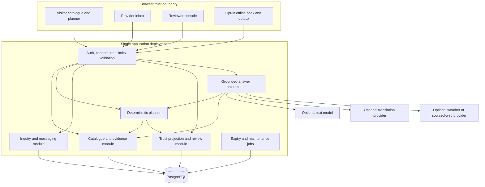

# Architecture and technical decisions

Status: **implemented as a working prototype and verified end to end** (see §9 for the evidence). This file explains component boundaries and trade-offs. Runtime sequences and failure handling are in [systemdesigning.md](systemdesigning.md); data contracts are in [data-model.md](data-model.md).

The prototype is deliberately narrower than this document: there is no database, no real authentication and no scheduled job runner yet. Where the code diverges from the design, §9 records it rather than the design being quietly rewritten to match.

## 1. Architecture choice

Use a **modular monolith**: one TypeScript web application, one PostgreSQL database, managed authentication, optional external AI/translation/weather adapters and a small scheduled-job mechanism.

Recommended starting stack: React with Next.js, TypeScript, server route handlers, PostgreSQL and schema validation. Use supported versions selected and pinned at implementation time; this pack does not assert a current package version. Managed PostgreSQL/auth can reduce operational work, but provider, deployment region and data terms remain unselected.

This is a recommendation based on the proposed workload, not evidence that the team already knows the stack. If the team has substantially stronger skills in another mainstream full-stack framework, preserve these boundaries rather than rewrite to satisfy a brand preference.

## 2. Component view

External providers never get direct database credentials or arbitrary mutation permissions. The browser never receives service-role database credentials or provider secrets.

## 3. Modules and responsibilities

| Module | Owns | Must not do |
|---|---|---|
| Catalogue | Place/listing records, curated aliases, source links | Assert that published capacity equals vacancies |
| Evidence/trust | Claim provenance, review, expiry, conflicts, authoritative projection | Treat recency or source domain alone as proof |
| Planner | Input validation, known-constraint filtering, budget arithmetic, proposed ordering | Invent route durations or generate a safety score |
| Inquiry | Thread membership, original messages, structured replies, acknowledgements | Reserve rooms or execute payments |
| Language | Capability registry, translation adapter, phrase review, originals | Treat transliteration as translation or overwrite originals |
| AI orchestration | Intent schema, minimal retrieval, grounded explanatory text | Arbitrarily browse, run code, change status or send messages |
| Integration | Provider-specific schemas, timeouts, usage accounting | Hide provider failure with invented output |
| Review/admin | Scoped approvals, consent, moderation and policy changes | Impersonate officials or provide broad default private-message access |
| Offline | Saved public snapshots and user-owned local drafts | Claim current data while offline or silently publish old operational edits |
| Jobs/observability | Expiry, retries, usage/error metrics and audit maintenance | Store raw private conversations in generic logs |

## 4. Decision record

| ID | Decision | Why | Revisit when |
|---|---|---|---|
| ADR-01 | Modular monolith over microservices | Small team, transactional consistency, one deployment | Independent teams or measured isolated scaling needs |
| ADR-02 | Relational records over a vector-first RAG system | Tiny catalogue with important typed dates/counts/permissions | A larger reviewed text corpus causes measured retrieval misses |
| ADR-03 | Deterministic planner; model explains results | Testable filtering and arithmetic | Never give unconstrained model authority over operational facts |
| ADR-04 | Polling inbox first | Simple, explicit refresh semantics | Measured latency/load requires SSE or a managed realtime channel |
| ADR-05 | Inquiry only, no booking | Avoid false inventory locking and payment complexity | Contracted operator integration plus reservation/refund requirements |
| ADR-06 | Original-first language service | Script and meaning quality are uncertain | Pair-specific evaluation passes |
| ADR-07 | Sources are field-level claims | Whole-record “verified” badges hide mixed freshness | Remains foundational |
| ADR-08 | Maps and turn-by-turn routing deferred | Adds provider, coverage, terms and real-world validation dependencies | A tested need and qualified provider coverage justify inclusion |
| ADR-09 | AI and provider failure degrade to templates | Core utility should not depend on model availability | Remains foundational |
| ADR-10 | No launch claim until consent and maintenance exist | Empty marketplace and stale data are operating failures | Real partner cohort and assigned reviewers available |
| ADR-11 | Default deny when identity is unverified; demo sessions are fixtures | A prototype may have no real accounts, and default access grants are hard to re-earn | Production auth with provider-authorizing surface (SC-05 in rules.md) |
| ADR-12 | Single active provider per capability, no runtime provider guessing | Silent failover hides failures and mixes privacy/accuracy semantics | A concrete reliability requirement justifies documented, tested capability-aware failover |

## 5. Retrieval and answer design

“RAG” is an approach, not a requirement to install a vector database. Start with typed SQL filters, curated place aliases and approved text snippets.

1. Validate user input and account scope.
2. Parse supported intent into a strict schema: `plan`, `place_fact`, `status`, `inquiry_draft`, `translate`, `weather_context`, `out_of_scope`.
3. Resolve ambiguity with the user; no best-guess property/entity when uncertain.
4. Retrieve only public approved facts and, for an authenticated private query, that user's permitted thread data.
5. Apply validity and conflict rules outside the model.
6. Compute plan candidates and numbers in code.
7. Supply a small evidence bundle with claim IDs and uncertainty labels.
8. Request structured output containing explanatory text, referenced claim IDs, unknowns and suggested actions.
9. Validate referenced IDs, sensitive numeric claims and prohibited claims. Reject unsupported output.
10. Render structured facts directly; use model text only where validation permits. Fall back to templates if uncertain.

A citation-ID check alone cannot prove semantic support. Critical fields are rendered from structured records, and prose still needs adversarial/human evaluation. Do not promise complete hallucination elimination.

## 6. Data access and security

- Authentication establishes actor identity; authorization separately checks role, entity scope and thread membership.
- Use server-side business checks and database row-level controls/least-privilege roles as defense in depth, with separate tests for privileged service contexts.
- Public reads use a projection excluding private evidence, private inquiry availability reports, contact consent internals and messages. A private host reply requires a separate explicit publication action before any derived availability can enter the public catalogue.
- Session secrets stay in secure, HTTP-only cookies where applicable; CSRF and origin protection apply to mutations.
- Every mutation validates an expected version when overwriting a projection; evidence history is append/supersede, not silent replacement.
- External URLs are untrusted. No arbitrary server URL-fetch endpoint. Allowlist retrieval hosts, block private IP ranges/redirect escapes and cap response sizes.
- Use escaped text/validated Markdown, not untrusted rendered HTML. Any provider-mandated rich source UI requires a narrowly designed isolation strategy consistent with its terms.
- Prompt injection from pages or messages cannot grant tool authority.
- Minimize personal information passed to providers. Decide retention and deletion before pilot.

## 7. Integration choices and gates

| Capability | Recommended stance | Required proof before enablement |
|---|---|---|
| Text assistant | Configurable provider/model adapter; no default model ID fixed here | Credentials, allowed use, schema support, latency and grounded-answer evaluation |
| Manipuri translation | Sarvam Translate is a documented candidate; BHASHINI is another candidate | Actual script behavior, pair-specific test, consent, terms/quota checks [S10–S14] |
| Transliteration | Optional independent adapter | Verified script mapping and tourism/name tests; no inferred Mayek support [S12] |
| Forecast | Optional Open-Meteo adapter or other approved source | Relevant location, units/time, intended-use terms; free tier not assumed [S18–S19] |
| Official warnings | IMD link-first; adapter only after access confirmation | Whitelisting/access, coverage and validity semantics [S17] |
| Search grounding | P1; background research only | Current API shape, citation/display terms, billing accounting [S15–S16] |
| SMS/WhatsApp/push | Not core; no assumed authorization | Sender setup, consent, deliverability and platform terms |
| Maps | Disabled for MVP | Qualified provider review, appropriate licensing/coverage, credential and coordinate-system handling |

No external provider is integrated by this documentation. No paid account or API subscription has been opened.

## 8. Deployment, cost and scale assumptions

Proposed pilot: tens of active users, under a few hundred curated entities, small messages and one region. These are engineering planning assumptions, not demand forecasts.

One app deployment + managed database + scheduled job. Static/public assets may use caching/CDN. No Kubernetes, Kafka, separate vector service or multi-region writes in the hackathon slice.

Monthly cost model to fill with verified provider prices:

`hosting + database + auth/messaging charges + model input/output usage + translation characters + search billed units + weather plan + storage/egress`

Owner approves a hard spend ceiling before any provider is enabled. Application-level limits cap turns, characters and allowed external calls; provider-generated search query count may not be directly controllable, so reconcile billed usage and disable grounding when the budget guard trips. No assumed free-tier commercial entitlement.

### Initial engineering budgets (targets)

- Active foreground inbox refresh: every 15 seconds; pause when hidden and refresh on focus.
- Typical non-AI JSON payload: ≤50 KB; bounded pagination for messages/catalogue.
- Initial compressed JS goal: ≤200 KB for the basic catalogue route, excluding separately loaded optional features.
- Database/API target: p95 ≤750 ms under the PRD test profile.
- AI request: bounded end-to-end 12-second timeout; translation/weather use shorter internal budgets.
- Daily backup and documented restore procedure before a pilot; retention/hosting capability must be verified.

If measured performance fails, reduce payloads and eliminate unnecessary model calls before adding infrastructure.

## 9. Current implementation status (21 September 2026)

This section records **observed runtime state**, not intended design. Updated after an implementation and verification pass: every row below was exercised against a live server, and the checks were re-run against a production build.

**Verification evidence (all green):**

| Check | Result |
|---|---|
| `tsc --noEmit` | exit 0 |
| `next build` (production) | exit 0, 27 routes, 22 static pages, no warnings |
| `eval/run.mjs` (assistant behaviour, 50 cases) | PASS 50/50 — on dev *and* on the production build |
| `eval/api-tests.mjs` (API contracts, 26 cases) | ALL PASS (26) — on dev *and* on the production build |
| `scripts/guard-probe.mjs` (output-guard unit cases) | ALL PASS (9) |
| Page routes (10 routes incl. a place detail page) | HTTP 200 with real content |

| Area | Observed state | Remaining gap against this pack |
|---|---|---|
| Catalogue | 8 seed place records; approved community uploads merge into place photos and survive restart | Licence metadata and per-photo attribution still thin |
| Planner/budget | Deterministic drafts; **nights arithmetic verified at 1/2/4/10/30 nights**; stop count capped by nights with a 500-returning invariant; legs resolve to place names | Constraint coverage (opening days, travel time) still limited |
| Inquiry loop | Actor-derived identity (cookie, server-side); provider scope enforced on read **and** write; body-supplied identity ignored; kind-specific expiry 7/21/14 days | Real authentication still a dev shim (ADR-11); see systemdesigning.md §13 |
| Assistant | Ordered intent router (safety/refusal outrank all); semantic output guard (structure, support, prohibited claims, stale-as-current); template fallback with a `degraded` reason | No benchmark of retrieval quality versus a baseline |
| Language | Phrase cards remain source-only; translation is a preview and never presented as verified | No externally verified Romanized Meiteilon support; treat as experimental |
| Trust model | `reviewState` and `freshness` are separate axes in code (`projectFreshness` derives from the claim's own time, never from review state); `structural` fields exempt from staleness | — |
| Persistence | File-backed stores (`.data/`) for inquiries and uploads | Database-backed projections, expiry jobs and RLS not implemented |
| Operations | No confirmed spend ceiling, backup/restore test, reviewer assignment or partner consent | Pilot gates remain unmet |

Deliberate simplifications that remain: no real authentication (a documented dev shim, not an accepted design), no database, no scheduled expiry job (expiry is computed at read time). Never describe this prototype as production-ready, verified, or carrying official endorsement.

## 10. Future architecture triggers

Add full-text/vector retrieval only after a benchmark demonstrates benefit. Add event-driven realtime only after polling load or interaction delay is a measured problem. Add booking only as an explicit scope change with inventory ownership and reconciliation. Expand local languages only with reviewers and measured pair coverage. Architecture complexity must answer a demonstrated need.
