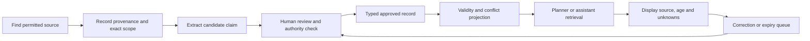

# Data sourcing, verification and maintenance

Status: proposed operating policy. Sources: [sources.md](sources.md). This process is as important as the AI interface: without maintainers, the product is a stale directory.

## 1. Source-to-answer pipeline

Private host replies are scoped to their inquiry by default. A public availability update is a separate provider-approved publication without visitor details; public retrieval never reads private replies.

No unrestricted scraping campaign is proposed. Start with manual collection of a small dataset from official/public sources and consented operator contributions. Robots policies, copyright, data licences, provider terms and contact privacy must be reviewed before automation or republication.

## 2. What counts as “real data”

| Data type | Honest label | What it does not prove |
|---|---|---|
| Official directory field | Published directory fact | Current vacancies, current operator or last field verification |
| Consenting host's dated answer | Host-reported for these dates | Reserved inventory, independent audit or area safety |
| Project review of a source | Project-reviewed source | Official endorsement or fresh field observation |
| Authorized official notice | Official notice, within named scope and dates | Every condition outside the notice's coverage |
| Weather model output | Forecast/model-derived context | Site sensor observation, boat operation or road openness |
| Search-derived page | Sourced web information | Live authoritative state |
| Synthetic scenario | Demo data | A real customer, host, closure or booking |

“Realtime” is allowed only for a measured software propagation property, e.g. “an accepted host update appeared after the next successful refresh.” It must not be used to suggest continuously observed physical conditions.

## 3. Minimal catalogue intake checklist

For each place/listing:

- Canonical source name and curated aliases; reject duplicate entities before combining facts.
- Source URL/title/publisher and exact field excerpt or minimal evidence note.
- Date of source publication if present; retrieval date separately.
- Applicable entity, geographic/service scope and event edition.
- Fact type: descriptive, operational, price, capacity, availability, accessibility or contact.
- Review owner and current review state.
- Permission/terms for any copied descriptions or media. Prefer original concise factual summaries over copied marketing prose.
- Contact publication consent where the app publishes a personal/operator contact or activates messaging.
- No unknown numeric fields filled with zeros.

Default initial records: 5–8 places, 2–3 consenting providers, a handful of reviewed phrases and only events with a confirmed edition. The dataset shrinks if verification fails; it does not get padded with generated facts.

## 4. Source priority is field-specific

- **Official restrictions/permit guidance:** use current responsible authority; host claims cannot override it. Link out rather than give personalized legal determinations.
- **Property vacancies/quotes:** dated operator response for exact dates is relevant; old official capacity is not an inventory feed.
- **Published property facts:** attribute directory values; resolve operator revisions as a field-specific review.
- **Festival dates:** organizer/current official edition announcement, not repeated dates from an old edition or an aggregator alone.
- **Forecasts:** source-specific valid time and model context; warnings and forecasts are different datasets.
- **Route/transport operations:** competent current operator/authority evidence for exact service; not an inferred consequence of weather or a blog.

Do not rank all official content over all operator content without comparing the actual field, scope and time. Do not accept a search result merely because its domain looks official.

## 5. Proposed freshness policy

All intervals below are **initial product policies for testing**, not researched facts about how quickly local conditions change. Operator input and pilot evidence may require shorter periods. The strictest valid bound applies.

| Fact | Initial policy | Expired/unknown behavior |
|---|---|---|
| Descriptive place/property metadata | Review reminder every 30 days | Keep attributed historical description; indicate unknown source age where applicable |
| Published total capacity | Review reminder every 30 days; operator reconfirmation before calling it current | Display only as published capacity, never vacancy |
| Host availability/quote | Expire 2 hours after actual report observation, or earlier explicit cutoff | “Reconfirm with host”; never imply held inventory |
| Property/activity opening report | Positive report expires after 4 hours, or earlier effective cutoff | Current state unknown; positive report not automatically renewed |
| Closure/restriction report | Respect explicit notice validity; preserve suppression/history until appropriate superseding evidence | Expiry does not reopen; “previous closure; current status unknown” |
| Festival dates | Edition-specific; check 7 days before and 24 hours before planned attendance where feasible | Do not show unconfirmed dates as current; never roll dates forward annually |
| Forecast | Cache target 30 minutes; mark retrieval stale after 60 minutes; also check provider valid/issue time | Stale/unavailable label; missing issue time disclosed; no automatic warning clearance |
| Official advisories | Use explicit validity and check source when consequential | Missing end/issue semantics → unknown, manual review, no reassurance |
| Phrase cards | Versioned human review; review after any wording/provider change | Unreviewed targets not published as reviewed |

Scheduled jobs are not the only enforcement: reads calculate expiry too. Manual review of a source does not reset observation time unless a new actual observation is recorded.

## 6. Conflict-resolution procedure

1. Confirm both claims refer to the same entity, field, dates and unit.
2. If they do not, display them separately; 13 total rooms and 2 available rooms are compatible.
3. Check authority for that specific claim type and whether either claim explicitly supersedes the other.
4. Compare observation/publication and effective dates; later retrieval alone does not win.
5. If a credible contradiction remains, mark conflict, suppress consequential recommendations and assign a reviewer.
6. Reviewer contacts the appropriate source only with permission and records a minimal outcome.
7. Publish correction with reason, preserve evidence history and flag affected saved plans on next online use.

No automatic majority voting among copied web pages. Multiple sites repeating the same notice are not independent confirmations.

## 7. Operating roles and maintenance workload

**Proposed roles, not recruited people:**

- Data steward: owns source ledger and overdue review queue.
- Provider contact: reports own availability and operational changes.
- Reviewer: resolves claims inside delegated scope.
- Language reviewer: signs off phrase pairs and critical translation tests.
- Incident owner: handles reports during stated pilot hours.

Before launch, record actual named owners, backup owner, available hours and escalation process. Do not promise 24/7 response. Measure editing effort: number of records due, minutes per verified update and unanswered inquiries. If work exceeds capacity, reduce catalogue scope or pause updates.

## 8. Fraud and abuse controls

- Listing claims are approved using a documented independent business-channel check; a self-entered phone number alone is insufficient.
- Display scope of verification instead of a quality guarantee.
- Separate operator self-reports from reviewer/official notices.
- Rate-limit new reports/inquiries; preserve reason codes and moderation history.
- Anonymous user reports enter review, not automatic public fact projection.
- Use no paid ranking in MVP. Later sponsorship must be disclosed and cannot suppress warnings or provenance.
- Do not publish private proof, reporter identities or live user locations.

## 9. Privacy and rights

Collect minimum data needed for an inquiry. Browsing does not require identity documents. Translation/AI disclosure must state that selected text may be sent to an external provider, and original-only mode remains possible.

Retention values are proposed in [data-model.md](data-model.md), not claimed legal limits. Before public launch, verify applicable privacy obligations, data-processing terms, consent language, deletion handling and permitted international processing with appropriate advice. Do not state that this specification by itself makes the app legally compliant.

## 10. Data acceptance gates

A record enters the public catalogue only when entity identity, source, field meaning, unknowns and publication permissions pass review. An operational feature additionally needs time bounds and a responsible maintainer. A translated phrase needs named competent review. A source integration needs tested payload/terms and a failure fallback.

If a gate fails, disable the affected feature or label it unconfirmed. Never solve a data gap by asking the model to produce a plausible replacement.
