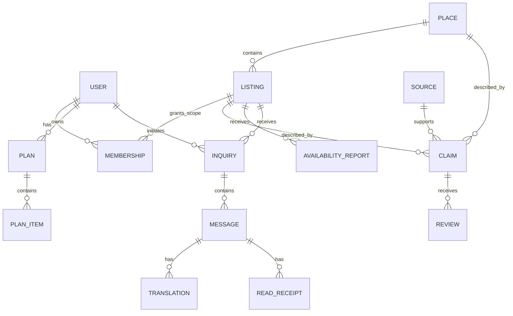

# Data model and invariants

Status: proposed schema specification; no database or migrations created. Canonical source for names/states used by [api-contracts.md](api-contracts.md) and [systemdesigning.md](systemdesigning.md).

## 1. Modeling principles

1. Separate entity identity from claims about it.
2. Separate published total capacity from date-specific host-reported availability.
3. Preserve originals and provenance; derived summaries do not replace them.
4. Store unknown as null with a reason, not zero, false, a guessed number or “open.”
5. Operational time bounds and local travel dates are first-class fields.
6. Never mix synthetic demo records and public-production projections.
7. Treat language and script as separate dimensions.

## 2. Entity relationships

The diagram is conceptual: claim target references are enforced with explicit entity typing/checks, not unconstrained dangling polymorphic IDs. Event and transfer entities below also receive claims.

## 3. Core tables

| Table | Required fields / meaningful nullable fields | Important constraints |
|---|---|---|
| `users` | `id`, auth subject, display name, preferred language/script, created time | No identity-document fields; no public email/phone by default |
| `places` | `id`, canonical name, curated aliases, category, locality, `is_demo`, version | Names are sourced; optional coordinates require source and coordinate-system tag |
| `listings` | `id`, `place_id`, type, display name, state, `is_demo`, version | State: directory_only / active / paused / suspended; in-app inquiry only active + consented |
| `memberships` | user, scoped listing/category, role, granted_by, granted_at, revoked_at | No public self-assigned host/reviewer role; active membership unique per scope/role |
| `listing_consents` | listing, consenting actor, permitted contact fields, inquiry consent, timestamps | Revocation suppresses relevant public contact/channel; historic audit retained under policy |
| `sources` | id, title, URL or private evidence reference, publisher, category, fetched_at, content digest, publication date nullable | Public URL not required for private host evidence; private reference never leaked in public projection |
| `claims` | id, entity_type/id, field_key, typed value, source_id, author_id, scope, observed_at nullable, valid bounds, expires_at nullable, review_state, supersedes_id, version | Review state and freshness are different; a typed schema governs each field |
| `reviews` | id, claim_id, reviewer, decision, reason, created_at, scope checked | Append-only decision history; reviewer cannot approve outside scope |
| `availability_reports` | id, listing, claim_id, visibility, inquiry_id nullable, unit, start_date, end_date_exclusive, availability kind, observed_at, expires_at, quantity nullable | No reservations; integer quantity ≥0 if provided; end date after start; whole interval coverage required |
| `events` | id, title, edition_year, venue/place nullable, organizer source, start/end nullable, confirmation state | State: historical / unconfirmed / confirmed / cancelled; edition distinct from fetched year |
| `transfers` | id, from_place, to_place, mode, source claim, lower/upper minutes nullable, applicable dates, review state | Direction matters; missing estimate blocks timed schedule, not all discovery |
| `plans` | id, owner nullable for local-only draft, brief, created_at, updated_at, status, evidence version snapshot | Status: draft / needs_recheck / archived; no confirmed-travel state |
| `plan_items` | plan, order, entity ref, date/window nullable, referenced claims and versions, unresolved constraints | No invented times when transfer/opening unknown |
| `inquiries` | id, visitor_id, listing_id, service/date fields, party size, state, created_at, updated_at | State: open / answered / closed; authenticated visitor and active provider needed |
| `messages` | id, inquiry_id, sender_id, server sequence, original_text, language/script nullable, structured fields, accepted_at, client_created_at nullable | Immutable original; unique per-thread sequence; limited length; authorized members only |
| `translations` | id, message_id, target language/script, provider/model/version, translated text, quality_state, created_at | Original unchanged; state: machine_unreviewed / human_reviewed / rejected; no inference of script support |
| `read_receipts` | inquiry, actor, last_read_sequence, recorded_at | Monotonic sequence, cannot exceed existing authorized message sequence |
| `phrase_cards` | id, intent, source text, language/script, translated text, reviewer(s), review date, version | Publish only reviewed target-language version; no invented Meiteilon content |
| `capabilities` | purpose, provider, language/script pair, evaluation version, enabled state, limitations | Default disabled; positive declared support does not equal approved quality |
| `idempotency_records` | actor, operation key, digest, response reference, created_at, expires_at | Unique actor/key; same key different payload is conflict |
| `audit_events` | actor, action, entity/version, timestamp, reason, request_id | Restricted append-only access; no full private message body |
| `abuse_reports` | reporter, target, category, minimal details, state, assigned reviewer | Reporter identity private; no automated public allegation propagation |

Provider billing counters, job leases and caches can use small additional tables without becoming independent services.

Availability kind: `reported_available | reported_unavailable | needs_details`. `visibility` is `inquiry_private | public`; default `inquiry_private` requires a matching `inquiry_id` and member authorization. `public` requires a separate explicit provider publication action; no private inquiry/message details may enter that record or its source projection. A private reply never automatically changes public availability. Unknown quantity stays null, even for a positive report. A `reported_unavailable` quantity must be zero or null, not positive.

Review decisions: `approve | reject | request_info`. `request_info` keeps the claim in `pending_review` and records the question; it does not introduce an unlisted review state. Claim review states are specified in [systemdesigning.md](systemdesigning.md#7-state-machines).

## 4. Claim types

Examples of allowed `field_key` values:

- `description`, `published_capacity`, `operator_reported_capacity`, `opening_window`, `accessibility_feature`, `contact_channel`.
- `operational_status`, `availability`, `quoted_price`, `event_dates`, `transfer_estimate`.
- Weather stored as a distinct external snapshot with provider, valid time, retrieval and optional issue time; it does not overwrite `operational_status`.

Each key has a schema. Prices use integer minor units and ISO currency code; never floating-point money arithmetic. Count and unit are explicit: rooms, people, boats and beds cannot be interchanged. Accessibility is a set of specific features with evidence, not a universal yes/no label.

## 5. Evidence categories

`official_publication | operator_report | project_observation | reviewed_reference | third_party_report | synthetic_demo`

A project reviewer checking an official URL does not transform it into a new government observation. A claimed official publisher requires authority verification. The category describes provenance, not a numerical trust score.

Computed public fields:

- `freshness_state`: current / stale / expired / unknown / conflict.
- `operational_state`: reported_open / reported_limited / reported_closed / unknown.
- `suppressed_reason`: active_restriction / unresolved_prior_closure / conflict / none.
- `display_label`, `source_links`, `time_basis`, `next_action`.

`current` means within the app's specified validity policy, not guaranteed objectively correct.

## 6. Real-source example — not operational seed data

From [S04](sources.md#s04):

| Field | Recorded meaning |
|---|---|
| Entity | Sendra Resort, Bishnupur, as named in the official directory |
| Claim | `published_capacity = 13 rooms` |
| Source | Official accommodation-directory URL |
| Source publication date | Unknown |
| Research retrieval date | 2026-09-20 |
| Current vacancies | Unknown |
| Current operator verification | Not performed |
| Current operational status | Unknown |
| Eligible UI wording | “Official directory lists 13 rooms; current availability unconfirmed.” |

Do not populate a live `availability_reports` row from this example. Do not generate coordinates, exact travel times, current contacts or pricing from it.

## 7. Hypothetical report example

**Synthetic fixture only:** `DEMO Stay A`, one room reported available for a hypothetical two-night interval. The fixture must have `is_demo=true`, synthetic contacts, a fixture clock and no real property association.

Its quantity means “the operator reports one room available throughout this interval,” not “one room exists,” “one room is held,” or “one room is guaranteed when the visitor arrives.” If availability differs across nights, use separate date slices and require coverage for every requested night.

## 8. Time and version invariants

- Instants: UTC storage; API includes explicit timezone offset. Travel dates: `YYYY-MM-DD` plus Asia/Kolkata interpretation.
- Check-in inclusive; checkout exclusive. Minimum one night for accommodation inquiry unless day-use is a separately supported type.
- A host cannot claim future observation; effective future dates are allowed, but report observation remains actual past/present time.
- `expires_at` must not exceed applicable `valid_until` when both express the same operational validity bound.
- Null publication time remains null; fetched/reviewed time cannot substitute.
- Same-field contradictions are retained for review. Revision numbers support optimistic concurrency.
- Closure expiry never emits an automatic open claim. Reopening requires explicit supersession with appropriate scope/evidence.

## 9. Authorization invariants

Visitors: own plans and member threads only. Hosts: approved listing reports and threads for those listings only. Reviewers: assigned claim types/listings; message access is not implied. Administrators: scoped control and narrowly justified incident access, audited.

Public catalogue excludes consent evidence, auth identifiers, unapproved private contact channels and raw operator proof. No private message or contact data appears in model retrieval for another user. Tenant/thread scope is enforced before retrieval, not filtered after model generation.

## 10. Retention proposal

For pilot approval: private inquiry/message retention **90 days after thread closure**; queued local drafts expire for sending after 24 hours and can be manually reviewed; application operational logs 30 days; minimal audit records 180 days, subject to incident/legal needs and deletion policy. These are design defaults, **not statutory requirements**.

User deletion removes/anonymizes personal data according to an explicit dependency policy; necessary non-identifying source provenance may remain. Backups have bounded retention and re-deletion procedures. Obtain privacy/legal review before a public service. No compliance certificate is claimed.
