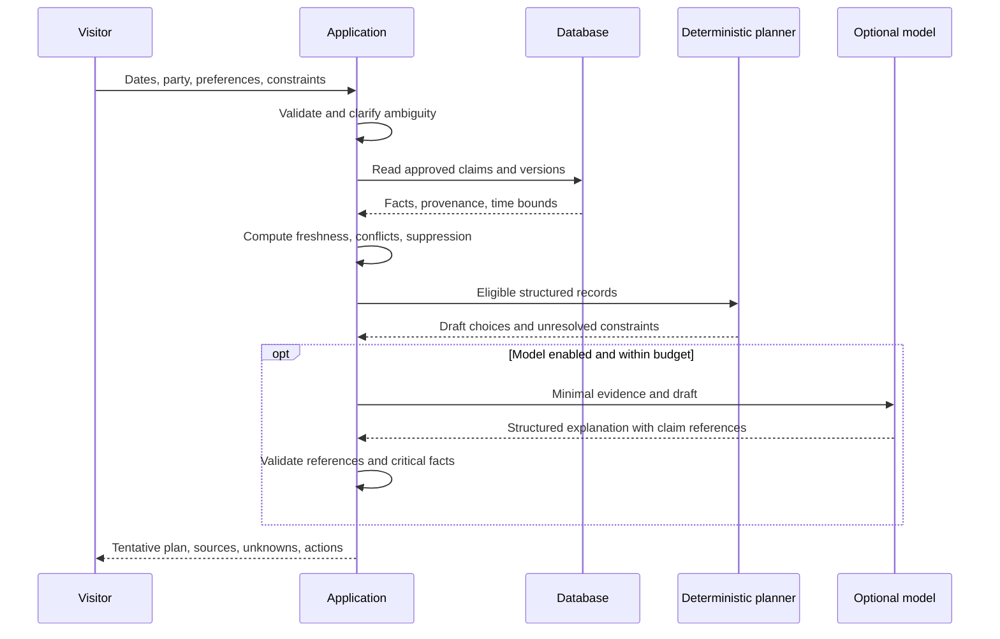
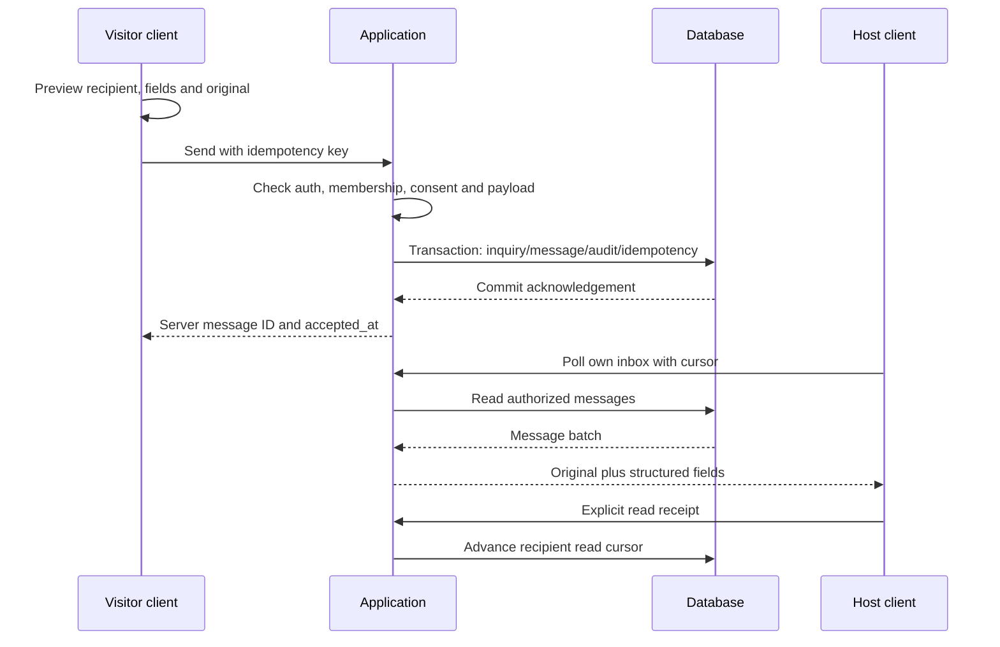

# System design — runtime behavior and failure semantics

Status: proposed design. No infrastructure, code or tests have been executed for the application. Companion files: [architecture.md](architecture.md), [data-model.md](data-model.md), [api-contracts.md](api-contracts.md).

## 1. Trust boundaries

1. **Browser:** untrusted input, local state and caches. Client timestamps cannot establish authoritative observation or server receipt.
2. **Application:** authenticates, authorizes, validates, computes trust and controls provider access.
3. **Database:** durable source records, claims, membership, messages and audit; scoped privileges and transactions.
4. **External providers:** untrusted outputs and separate privacy/availability boundaries.
5. **Humans:** reviewers and hosts have bounded authority; no human role is infallible or automatically governmental.

## 2. Planning request sequence

Read a coherent database snapshot for an individual planning response. Include catalogue/projection versions in the response. If versions change during a longer generation, revalidate critical status before returning; otherwise mark the answer stale and regenerate/fall back. No generated text can override the deterministic closure filter.

## 3. Inquiry send sequence

“Sent” is a durable server acceptance, not a host response. A read cursor proves the authenticated client reported reading the message; it is not proof a human understood it. The UI must not imply more.

## 4. Message idempotency and ordering

- Client generates a unique operation key before its first send and persists it with the local draft.
- Server uniqueness is scoped by actor and operation key, with a payload digest. Same key/same payload returns the original result; same key/different payload returns conflict.
- Inquiry creation and initial message are one transaction. A host reply and any linked private availability report also commit together; a failed report validation cannot leave a misleading positive message in history.
- A private reply never updates the public listing automatically. Explicit public publication creates a separate report stripped of inquiry/member details.
- Message sequence is server-assigned per thread. Client-created time is informative only; pagination uses stable server sequence/cursor.
- A timeout after commit must not produce a second message. Client retries with the same key.
- As a proposed default, retain idempotency records for **7 days**, with maximum sendable outbox age of **24 hours** and mandatory re-confirmation of old drafts. These are configurable product policies, not standards.
- When a queued draft becomes invalid, show **Needs review** and stop auto-retry.

## 5. Canonical trust projection

An entity can have many claims. The public projection is a computed view, not a single “truth row.”

For each field:

1. Keep only claims whose entity and scope match the question.
2. Check editor authority and source category for the field.
3. Compare effective dates, observed/published time and explicit validity.
4. Detect contradictions among relevant credible claims.
5. Output value if support is appropriate; otherwise null plus unknown/conflict/expired reason.
6. Preserve prior restriction/closure history independently of positive-status expiry.

An authoritative restriction and a host's availability report describe different control layers: a host cannot negate a public restriction by reporting rooms available. A dated host report may be more useful for **vacancies** than an old directory; official source priority is field-specific, not universal.

## 6. Freshness clocks

- `published_at`: publisher's date, nullable.
- `observed_at`: actual reported observation time, nullable for old static records.
- `fetched_at`: when this system retrieved the evidence.
- `reviewed_at`: when a reviewer checked provenance; not a new field observation.
- `valid_from` / `valid_until`: applicable period.
- `expires_at`: application freshness cutoff, only for claims with a meaningful time basis.
- `computed_at`: when server projection was calculated.

All instants stored in UTC with explicit offsets on interchange. Local travel dates use Asia/Kolkata with separate date-only semantics. Do not add 24 hours to a timezone-naive timestamp and assume a correct local stay interval.

Age displayed as both relative and absolute time where consequential. If source observation is unknown, label **“Source date unknown; retrieved …”**. Re-fetching unchanged old information does not refresh its truth.

## 7. State machines

### Claim review

`draft → pending_review → approved | rejected`; approved records may become `superseded` or `withdrawn`. Corrections create a new claim/version with a link to the earlier record.

### Computed freshness

`current | stale | expired | unknown | conflict` is computed separately from review approval. An approved claim can be expired. A recent claim can be unreviewed.

### Operational projection

`reported_open | reported_limited | reported_closed | unknown` plus freshness and provenance. No `safe` state. Prior closure remains a suppression reason after expiry until appropriate reopening evidence supersedes it.

### Inquiry

`open → answered | closed`; answered can receive follow-up and return to open. Closure is user/provider workflow completion, not confirmation of a reservation. Per-message outbox/read states are separate.

### Local outbox

`draft → queued → sending → accepted`; failure can return to queued or move to `needs_review`. Read receipts are remote metadata, not an outbox state.

## 8. Concurrency and consistency

- Catalogue review uses optimistic versions. If two reviewers act on the same version, the second receives a conflict and must reread; never silently overwrite.
- Different claims append independently; projection recomputation detects contradictions.
- Provider scope and consent are rechecked at transaction time, not only when a page loads.
- A listing suspended between draft and send rejects the send with a recoverable error.
- Core messages and review outcomes need transactional durability. Search, model explanations and aggregate analytics are non-authoritative and can lag.
- Jobs recompute expiry projections, but every API read also enforces current validity; a missed scheduled job cannot keep an expired claim “current.”

## 9. Caching and offline design

| Data | Browser policy | Server policy |
|---|---|---|
| Public catalogue descriptions | Versioned cache and explicit saved snapshot | Conditional caching by projection version |
| Operational status | Network-first; offline snapshot visibly non-current | Enforce expiry on every read |
| Weather | Display valid time and age; stale banner if needed | Provider/terms-compliant cache; default fetch-cache target 30 minutes |
| Private inbox | Memory while online; optional user-owned draft storage only | Authorized reads, no shared public cache |
| Phrase cards | Versioned approved offline bundle | Reviewed language/script version |
| Admin interface | No offline mutation queue | Fresh auth and version on every mutation |

Logout clears local private drafts/tokens/cache associated with the account after warning about unsent work. Saved public content and user-owned itinerary storage require explicit controls; avoid sensitive shared-device persistence by default.

## 10. External integration failure matrix

| Failure | User-visible result | System behavior |
|---|---|---|
| Text model timeout/malformed output | Structured draft and sources without AI prose | Log error class; bounded fallback; no repeated costly loop |
| Translation unavailable | Original text and reviewed phrases | Preserve original; retry only on explicit action or safe policy |
| Weather service stale/down | “Forecast unavailable” or clearly stale snapshot | No invented fallback values |
| Search has no sources | “No sufficient sourced information found” | No uncited operational answer |
| Database unavailable | Read-only cached public pack; messages not sent | Reject mutations, retain local draft, never acknowledge commit |
| Auth expired | Reauthenticate before remote mutation | Preserve draft locally subject to consent |
| Provider rate limit | Explain feature unavailable; core browsing works | Backoff within a bounded request budget; circuit breaker |
| Budget limit | Optional AI/search disabled | Continue deterministic planner and direct inquiry |
| Stale host report | “Please reconfirm for these dates” | Do not extend expiry because the host logged in |

No promise of emergency availability, automatic failover across every provider or zero data loss is made.

## 11. Observability and recovery

Log request ID, actor pseudonymous ID, operation, status, duration, provider billed-unit estimate, relevant record version and error class. Do not log private message bodies, identity documents, full query strings with location/preferences, secrets or raw model context by default.

Metrics: inquiry completion, first human response time, unanswered inquiry age, stale-record share, citation validation failures, translation critical-error flags, outbox retry/duplicate rate, authorization denials and optional-provider spend. Separate real pilot, staff test and synthetic fixture environments.

Before pilot: test backup restore into isolated storage, document point-in-time capabilities of the chosen provider and recovery ownership. Proposed planning objectives are **RPO 24 hours / RTO 4 hours**, not guarantees; messaging expectations may require tighter settings before a public launch.

## 13. Prototype observation register (20 September 2026)

Observed in the existing local prototype `apps/web` by static inspection; not re-executed in this pass and not production evidence.

- Inquiry creation and reply integrity rules appear implemented in the file-backed store: idempotency key plus payload digest, rejection of duplicate-and-different payloads, per-thread monotonic sequences and host-reported replies.
- Two gaps to fix before treating this behavior as a specification match: any caller can currently list all inquiries without actor scoping, and sender identity is taken from the request body instead of an authenticated session. This conflicts with the actor-identity requirements below and requires explicit test cases [T06 in testing.md](testing.md).
- Representative implementation references — not endorsements: inquiry integrity logic, public place retrieval adapter, intent routing with template fallback, and the inquiry API handler. Deterministic filtering and arithmetic remain app-side; citations alone never establish correctness.

## 14. Scaling and operational responsibility

Scale catalogue reads with projections/indexes first. Add a separate worker only when job workload justifies it. Add realtime transport only after measuring polling load. Maintain the same authorization for any future websocket/SSE channel.

One named project operator owns daily data-review checks and user reports during a pilot. If no such person exists, do not present the product as a maintained service. The app must show support hours/limitations rather than suggest constant monitoring.
