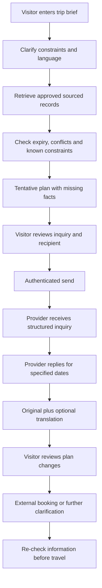

# Detailed product and operating workflows

Status: proposed, not implemented. Research: [research.md](research.md). Canonical states: [data-model.md](data-model.md). Rules: [rules.md](rules.md). Claim statuses: [claims.md](claims.md). Execution order: [tasks.md](tasks.md).

## 0. Reconciliation with the existing prototype

The prototype under `apps/web` already exercises W01–W07 in a simplified form. Where the two differ, this document defines the intended behavior and [tasks.md](tasks.md) defines the work to close the gap. Two observed shortcuts must not be mistaken for the specification: inquiry listing without actor scoping, and client-supplied sender identity (assessment in [systemdesigning.md](systemdesigning.md) §13).

## 1. End-to-end product loop

No arrow in this flow implies inventory reservation, official clearance or guaranteed message delivery.

## 2. W01 — Visitor discovery and planning

**Problem:** a directory fact may be mistaken for current trip-specific information. Evidence: S04–S06 in [sources.md](sources.md).

**Actor:** visitor, anonymous for browsing and local draft planning.

1. Choose “Plan a visit,” dates/nights and group size. UI makes the exact resolved dates visible.
2. Add interests and budget. Ask whether the budget includes accommodation only or all costs; if unspecified, do not compute a total.
3. Ask transport mode/assumption and relevant mobility/access needs. These are private preferences, not public profile data.
4. Choose language and script separately; unsupported combinations are clearly disabled.
5. Retrieve relevant catalogue records, not the model's remembered tourism knowledge.
6. Evaluate every operational claim for scope, validity, status and source age.
7. Produce one or two explained options: e.g. an Imphal-based draft versus a lake-focused draft. Do not prescribe a night in Sendra simply because it sounds attractive.
8. Show missing confirmations: accommodation response, activity operating hours, transfer time, access details or current official guidance.
9. Offer “Ask this provider,” “View source,” “Change constraints,” and “Save offline.”

**If information is insufficient:** return an unscheduled ideas list. Example wording: “I can suggest an order, but I do not have verified transfer times for these dates.”

**If no candidate fits:** explain the constraint, ask which preference may change, and preserve the original request. Do not relax budget/access requirements silently.

**Success:** a transparent draft plus actionable unanswered questions, not necessarily a complete timed itinerary.

## 3. W02 — Visitor-to-provider inquiry

**Problem:** informal inquiries can omit essential dates, group size or service details. This is a hypothesis pending interviews.

**Precondition:** provider has opted into the service and the listing claim is approved. Otherwise show an attributed external contact/handoff, with no promise of an in-app response.

1. Visitor selects a provider and dates from the draft.
2. App creates structured inquiry fields: service/listing, check-in/check-out or activity date, party size, question type and optional message.
3. Minimize disclosure: include only relevant needs the user chooses to share. Do not send the entire itinerary or accessibility profile automatically.
4. Require a visitor account before creating a private remote thread; anonymous browsing remains available.
5. If translation is enabled, preview original and translated text before send. Preserve structured dates/numbers separately.
6. Visitor confirms recipient and message. Assistant has no standing permission to message arbitrary providers.
7. If offline, save a **local queued draft**. “Not sent” remains visible. On reconnect, revalidate dates and ask again if recipient/text changed or travel date has passed.
8. Server authenticates membership, validates payload and idempotency key, then commits inquiry and initial message in one transaction.
9. Only after server acknowledgement show **Sent to service**. That is not read/delivered-to-device.
10. Provider polls the inbox or receives a future opt-in notification; read is shown only after an authenticated read receipt.

**Failure branches:** blocked recipient → reject with reason; deleted listing → prompt new recipient; timeout after send → query/retry with same key; duplicate retry → return original message, never send again; unsupported language → original plus reviewed phrase options.

## 4. W03 — Host response and availability

**Actor:** provider, constrained to their approved listing.

1. Open inquiry showing dates, group and original text first.
2. Choose response: **available as reported / unavailable as reported / need more details**.
3. Enter applicable dates, unit/room type, optional quantity and optional quote/currency. Never force a fabricated price.
4. Availability quantities, if used, refer to what the host reports for the whole stated interval. Split the report if availability differs by night; checkout is exclusive.
5. Record “observed now” only when the operator actually checked now. An old external note retains its old observation time.
6. Server timestamps receipt, applies policy expiry and validates that dates and quantities make sense.
7. Display reply as **Host-reported**, not audited inventory. A response does not reduce capacity or create a booking.
8. Visitor sees original, translated text if enabled, structured fields and expiry. This is a private inquiry response. Publishing public availability requires a separate explicit provider action and a new public report without visitor details.
9. Visitor asks follow-up or follows the provider's external booking process. UI says “Booking is handled outside this app.”

**Critical edge:** two travellers can both receive positive inquiries; this app does not prevent overbooking. Report expiry and “not reserved” copy must be prominent. If providers require allocation, that is a different later product with transactional inventory.

## 5. W04 — Translation and phrase-card bridge

**Problem:** translating meaning and changing script are different operations [S10–S14].

1. Store original text unchanged with user-declared language/script if supplied; detection is only a suggestion.
2. Map requested language/script pair to an evaluated capability entry.
3. If unsupported or not reviewed, offer original text, reviewed phrase cards and structured inquiry fields. Explain the limitation.
4. If supported, show consent before sending text to an external translation provider. Never send unrelated history or identity data.
5. Protect names, structured dates, currency and quantities by rendering those fields outside the translated prose. Do not assume opaque placeholder tokens will survive translation unless tested.
6. Translate through the selected adapter; a script-conversion step is optional and only used for an independently tested mapping.
7. Verify critical fields and assess error flags. If checks fail, suppress the translation, preserve the original and request clarification.
8. Label machine output. Recipient can view original, flag an error and reply in their preferred language.
9. Store human corrections as new reviewed translations linked to the original, never silently edit the original message.

**Critical messages:** allergies, accessibility constraints, help requests, refusal/negation and time-sensitive operational instructions must not rely on unreviewed prose translation alone. Use explicit structured choices and direct human clarification. The app is not an emergency interpreter.

## 6. W05 — Provider onboarding and claim approval

1. A prospective provider consents to being listed and to receiving inquiries.
2. Project administrator checks a real connection to the listing using a documented, permissioned process such as a callback through an independently found official business channel.
3. Store a minimal verification outcome and evidence reference; do not collect Aadhaar/passport images for the demo.
4. Record exactly what was checked: **control of listing contact**, not service quality, government recognition or safety.
5. Approve listing-scoped membership. No domain-wide or district-wide authority follows from being a host.
6. Provider selects preferred language/script and response hours if desired; these are preferences, not guaranteed service levels.
7. Show how to pause inquiries, revoke contact consent, report abuse and leave the platform.
8. If consent/claim cannot be verified, keep the listing as attributed public directory information with in-app messaging disabled.

**No automatic partnership:** a government role, council-verifier badge or agency logo needs written authorization. Demo actors are labeled project reviewers or synthetic hosts.

## 7. W06 — Data update and review

**Actors:** provider, project reviewer; optional authorized official publisher in future.

1. Submit a field-scoped claim, e.g. property opening window or activity suspension.
2. Include source/author, observed time, effective dates, relevant entity and reason/evidence.
3. Validate editor scope. A boat operator may report their own service, not a blanket status for the lake or a public road.
4. Store pending claim and append an audit event. Operator self-reports may be displayed in their own category without being promoted to official facts.
5. Reviewer compares scope and dates. Different scopes may coexist; contradictory same-scope claims become **conflict**, not last-write-wins.
6. Approve, reject or request clarification. Record reason and provenance.
7. New projection/version becomes visible on the next successful client refresh; saved plans receive a change notice.
8. Invalidate affected cached public projections. The client still independently calculates age and expiry.

**Closure handling:** a credible scoped closure report suppresses that activity pending review. Anonymous allegations do not automatically become authoritative public status, but trigger moderation. Expiry of a closure does **not** establish reopening; show “previous closure; current status unknown” until explicitly superseded.

## 8. W07 — Freshness and conflict resolution

When asked “Is this open now?”:

1. Resolve exactly which place/service and which time; ask if ambiguous.
2. Retrieve relevant claims, not all mentions of the place.
3. Apply publication/observation/validity semantics.
4. If active authoritative restriction applies, display the source and do not recommend the affected service.
5. If a current property operator reports operation within their own scope, say **“Operator reports…”**, never “the area is safe.”
6. If credible sources conflict, show both with their dates and identify what needs confirmation.
7. If evidence is absent/expired, state unknown and offer contact or official-source links.
8. Alternative activities may be shown only with their own evidence checks; label them alternatives, not “safe alternatives.”

Example: a directory lists 13 rooms while a host reports 2 available for requested dates. These are different quantities, not a conflict. A host reporting a revised **total capacity** of 12 creates a same-field discrepancy requiring review.

## 9. W08 — Weather and web freshness (optional)

1. Visitor requests weather for a selected place/date.
2. Use a curated public-place coordinate/identifier, not the visitor's continuous location.
3. Fetch only through an approved adapter with terms/coverage tested.
4. Preserve provider, retrieval time, forecast valid time, issuance time if supplied, units and approximate location.
5. If issuance is absent, say so; do not use fetch time as a fake observation time.
6. Show forecast context separately from verified official warnings and local operational claims.
7. Forecast rain may prompt “check with the operator,” never automatically “boats closed” or “road unsafe.”
8. If the provider is down, use last permitted cached forecast with a stale badge or show unavailable. No model-invented weather fallback.
9. Search lookup is separate: external citations remain background evidence and never auto-update operational state.

## 10. W09 — Offline and reconnection

**Offline allowed:** saved public plan, source snapshot, approved phrase cards, locally drafted inquiry. All show offline/age labels.

**Offline disallowed:** claims of live availability, AI generation through a cloud service, server-verified delivery, public operational edits and private admin actions.

On reconnect: authenticate → fetch changed record versions → mark old plan items → ask about consequential changes → revalidate outbox → send with original idempotency key → wait for server acknowledgement. Operational updates require an online re-confirmation so an old closure/opening draft is not silently published late.

A browser sync event is optional optimization. Foreground “Retry” is always available. Do not auto-send a local draft if user authorization has been revoked or the intended date is past.

## 11. W10 — Host event planning (later)

The host asks about nearby upcoming events. Retrieve only edition-specific confirmed events in the scoped catalogue. If none exist, say “No confirmed event dates in our current dataset,” not “there are no festivals.” Show date/source and possible relevance. Do not infer a visitor count, revenue forecast or room occupancy from festival budgets. This is P1, not needed for the core inquiry demo.

## 12. W11 — Correction, abuse and incidents

Report source error/translation issue → classify urgency → hide or annotate disputed content as appropriate → notify assigned reviewer → retain provenance → correct/supersede → notify affected saved-plan users on next online visit. Do not reveal reporter identities.

Block abusive senders without losing the recipient's access to legitimate history. Administrative message-content access, if exceptionally needed for a reported incident, requires an explicit reason, narrow scope, access log and retention limits. There is no always-on monitoring or emergency response promise.
